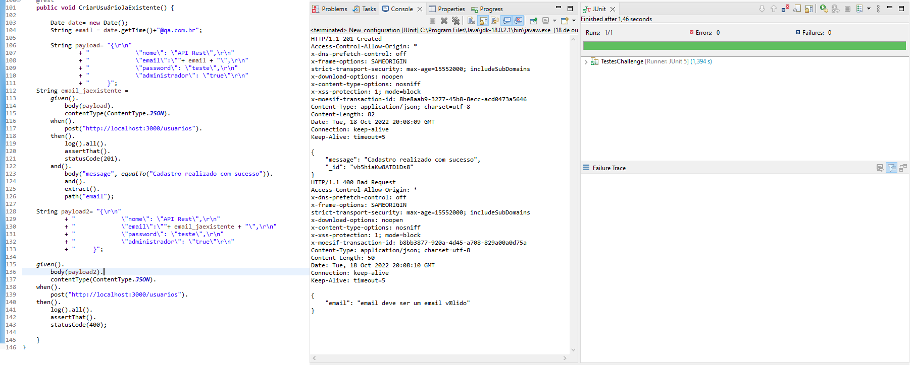
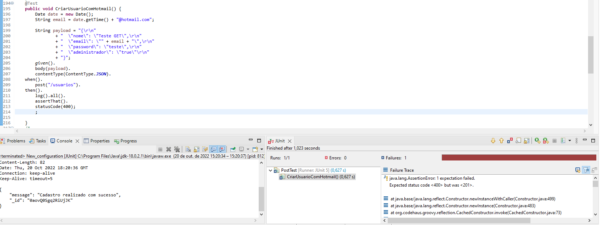
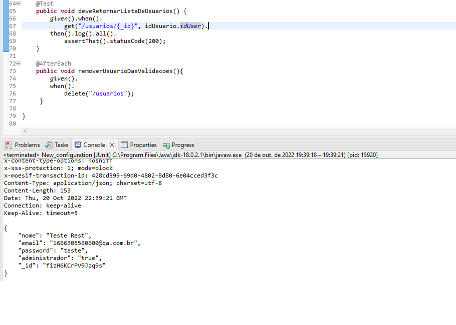
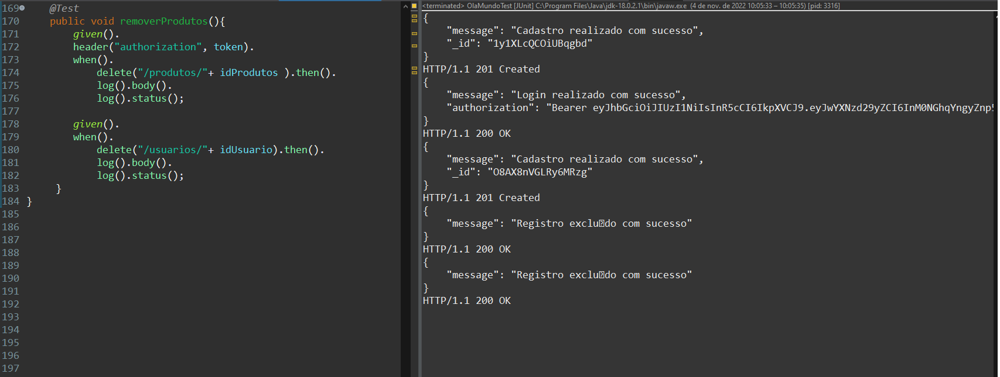

# Cenários de testes
## Tabela de testes e resultados

## Testes de usuário
ID    |  Descrição |Resultado esperado |Resultado Atual |
------|------------|-----------|-----------|
1     |Criar um usuário com campo nome em branco| Sistema não pode permitir que o campo nome fique em branco |OK
2     |Criar usuário com campo email em branco|Sistema não pode permitir que o campo email fique em branco | OK
3     |Criar usuário com campo password em branco|Sistema não pode permitir que o campo password fique em branco |OK
4     |Criar usuário com administrador em branco |Sistema não pode permitir que o campo administrador fique em branco |OK
5     |Criar um novo usuário utilizando o POST com um email já existente| Não deve ser possível criar um usuário com e-mail já utilizado | OK
6     |Criar um usuário com um ID não existente através do PUT |Caso não seja encontrado usuário com o ID informado no PUT, um novo usuário deverá ser criado|OK
7     |Criar um novo usuário utilizando o PUT, porém com mesmo email já existente | Não deve ser possível cadastrar usuário com e-mail já utilizado utilizando PUT |OK
8     | Criar um novo usuário com provedor de gmail, utilizando o POST | Não deverá ser possível cadastrar usuários com e-mails de provedor gmail e hotmail|Erro
9    | Criar um novo usuário com provedor de hotmail, utilizando o POST | Não deverá ser possível cadastrar usuários com e-mails de provedor gmail e hotmail|Erro
10     |Criar um usuário com email não válido utilizando o POST | Os e-mails devem seguir um padrão válido de e-mail para o cadastro| OK
11     | Criar um usuário com uma senha abaixo de 5 caracteres |As senhas devem possuír no mínimo 5 caracteres e no máximo 10 caracteres| Erro
12     | Criar um usuário com uma senha acima de 10 caracteres| As senhas devem possuír no mínimo 5 caracteres e no máximo 10 caracteres|Erro
13     | Ver todos os usuários | Todos os usuários devem ser listados| OK
14     | Listar usuário com ID | O usuário com id deve ser listado | OK
15 | Listar usuário com ID inexistente | Deve dar erro |OK
## Testes de login
ID    |  Descrição | Resultado esperado | Resultado atual|
------|------------|-----------|-------|
1     |Tentar logar com usuário não existente|Usuário inexistente não deve conseguir autenticar| OK
2     |Fazer login com senha incorreta| Usuários com senha inválida não deverão conseguir autenticar e  deverá ser retornado um status code 401 (Unauthorized) |OK
3     |Logar com usuário e senha válidos| Usuários existentes e com a senha correta deverão ser autenticados e deverá gerar um token Bearer| OK
4     |Logar com senha vazia somente com espaço|O usuário não deve conseguir autenticar  | OK
5     |Logar sem email apenas com senha | O usuário não deve conseguir autenticar |OK
6     |Logar sem senha apenas email| O usuário não deve conseguir autenticar |OK

## Testes de produto

ID    |  Descrição | Resultado esperado | Resultado atual|
------|------------|-----------|-------|
1     |Cadastrar produtos | Usuario deve cadastrar produtos| OK
2     |Cadastrar produtos com nome já utilizados | Usuário não deve conseguir cadastrar produtos com mesmo nome |OK
3     |Cadastrar produto sem nome | Usuário não deve cadastrar produto sem nome| OK
4     |Cadastrar produto com preço nulo |Usuário não deve cadastrar produto com preço nulo  | OK
5     |Cadastrar produto sem descrição |  Usuário não deve cadastrar produto sem descrição |OK
6     |Cadastrar produto com quantidade nula| Usuário não deve cadastrar produto com quantidade nula |OK
7     |Cadastrar produto sem token |  Usuário não deve cadastrar produto sem token | OK
8     | Cadastrar produtos com todos os campos nulos | Usuario não deve cadastrar produtos com todos os campos nulos | OK
9     | Listar produtos cadastrados | Todos os produtos cadastrados sejam listados | OK
10    | Listar produto por id |  Listar o produto com id | OK
11    | Listar produto não existente |  Nenhum produto deve ser encontrado | OK
12    | Editar dados do produto  | Produto deve ser atualizado com novos dados | OK
13    | Editar produtos sem token | Produto não pode ser editado sem o acesso token | OK
14    |  Criar um novo produto com PUT utilizando ID inexistente |Um novo produto devera ser criado através do PUT com id não existente | OK
15    |  Excluir produto | Produto deve ser excluido | OK
16    | Excluir produto sem fazer login | Produto não pode ser excluido sem login | OK
17    | Excluir produto que está dentro do carrinho | Produto que está dentro do carrinho não pode ser excluido
18    | Exclui produto com usuario que não adminitrador | Usuário que não é administrador não pode excluir produtos
| OK

### Testes de carrinho
ID    |  Descrição | Resultado esperado | Resultado atual|
------|------------|-----------|-------|
1     |Cadastrar carrinho | Realizar o cadastro de carrinho| OK
2     |Cadastrar carrinho com quantidade 0 de produtos | Não deve cadastrar carrinho sem produtos | OK
3     |Cadastrar carrinho sem token| Não deve cadastrar carrinho sem token | OK
4     | Ver carrinho por id | Listar carrinho com id especifico |OK
5     | Ver carrinho com id inexistente| Não deve ter carrinho com idInexistente | OK
6     | Concluir uma compra | Concluir compra e excluir carrinho| OK
7     | Concluir compra sem token | Não se deve concluir compra sem token | OK
8     | Cancelar compra e devolver produtos para estoque | A compra deve ser cancelada e os produtos devolvidos |OK
9     | Cancelar uma compra sem token | Uma compra não pode ser cancelada sem token |OK

## Execução dos testes de usuários

ID 1 -  Criando um usuário com campo nome em branco

ID 2 - Criando usuário com campo email em branco

ID 3 - Criando usuário com campo password em branco

ID 4 - Criando usuário com administrador em branco

ID 5 - Criar um novo usuário utilizando o POST com um email já existente  

ID 6 - Criar um usuário com um ID não existente através do PUT

ID 7 - Criar um novo usuário utilizando o PUT, porém com mesmo email já existente

ID 8 - Criar um novo usuário com provedor de gmail utilizando o POST

ID 9 - Criar um novo usuário com provedor de hotmail, utilizando o POST

ID 10 - Criar um usuário com email não válido utilizando o POST

ID 11 - Criar um usuário com uma senha abaixo de 5 caracteres 

ID 12 - Criar um usuário com uma senha acima de 10 caracteres

ID 13 - Ver todos os usuários

ID 14 - Ver usuário por ID

ID 15 - Listar usuário com ID inexistente

ID 16 - Criar usuário

## Execução dos testes de Login

ID 1 - Tentar logar com usuário não existente

ID 2 - Fazer login com senha incorreta

ID 3 -  Logar com um usuário e senha válidos

ID 4 -  Logar com senha vazia somente com espaço

ID 5 - Logar sem email apenas com senha

ID 6 - Logar sem senha apenas com email

## Execução dos testes de produtos

 ID 1 - Cadastrar produtos

ID 2 - Cadastrar produtos com nome já utilizados

ID 3 - Cadastrar produto sem nome

ID 4 - Cadastrar produto com preço nulo

ID 5 - Cadastrar produto sem descrição

ID 6 - Cadastrar produto com quantidade nula

ID 7 - Cadastrar produto sem fazer token

ID 8 - Cadastrar produtos com todos os campos nulos

ID 9 -  Listar produtos cadastrados

ID 10 - Listar produto por id

ID 11 - Listar produto não existente

    
ID 12 - Editar dados do produto

ID 13 -  Editar produtos sem token

ID 14 - Criar um novo produto com PUT utilizando ID inesxistente

ID 15 - Excluir produto

ID 16 - Excluir produto sem fazer login

 
ID 17 - Excluir produto que está dentro do carrinho

ID 18 - Excluir produto com usuário que não é adm

