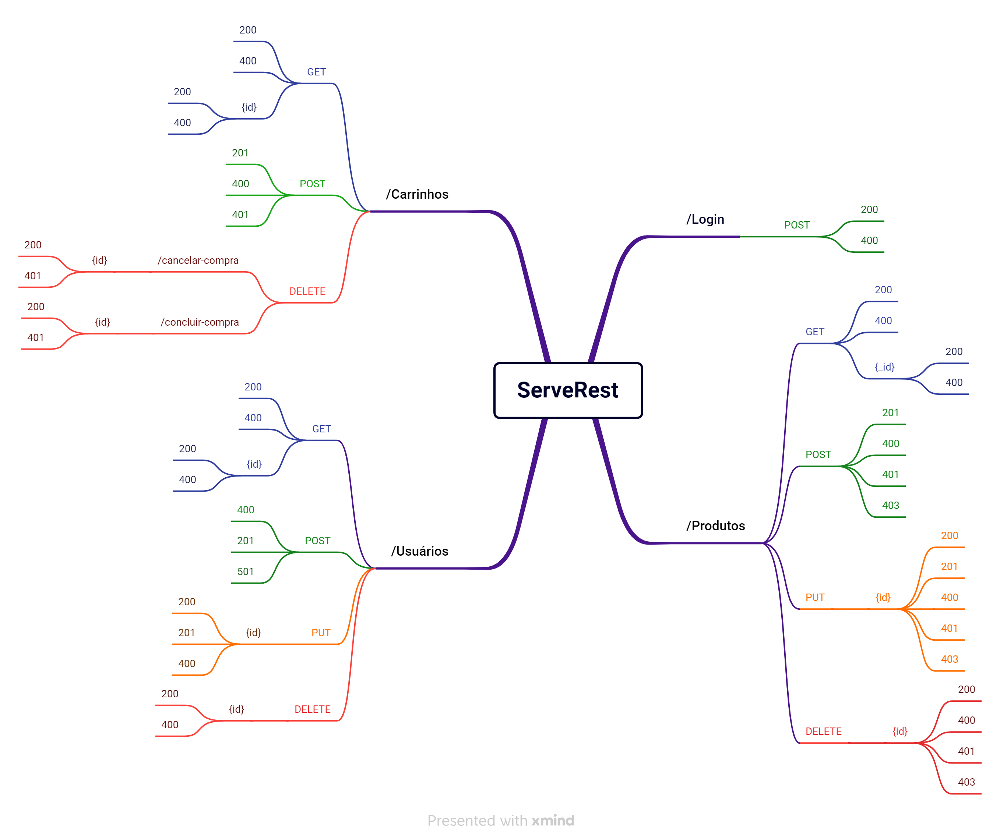

## Mapa mental
Realizou-se um mapa mental de toda API ServerRest para auxiliar na ánalise do planejamento dos testes.

Para a Sprint 5 foram analisados e discutidos para testes os campos de usuário, login, produtos e carrinhos.

## [Plano de testes](/PlanejamentoDeTestes/PlanoDeTestes.md)
Para o planejamento do plano de testes foram apontados os seguintes tópicos:

### Introdução
- Objetivos
- O sistema Server Rest
- Escopo
### Itens-alvo dos testes
- Funcionalidades ou Módulos a serem testados
- Recursos necessários
- Riscos
### Técnicas e tipos de testes
- Testes funcionais

### Critérios de aceitação para os testes
- Critérios de Login
- Critérios de usuário
- Critérios de produto

### Programação dos testes
- Testes de usuário
- Testes de login
- Testes de produto
- Testes de carrinho
### Cronograma

Dia do teste |   Descrição
-------------|------------
Sprint 2     | 15 testes
Sprint 3     | 6 testes
Sprint 4     | 18 testes
Sprint 5     | 10 testes

### Como os resultados serão divulgados

Resultado dos testes com rest Asssured: [aqui](/PlanejamentoDeTestes/TestesRestAssured.md)

Códigos do teste: [aqui](/Challenge/)

